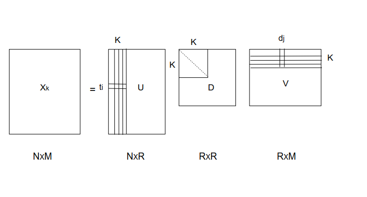
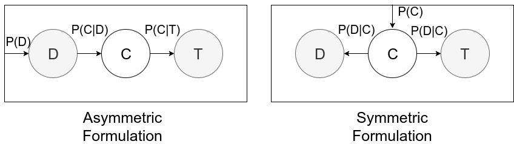
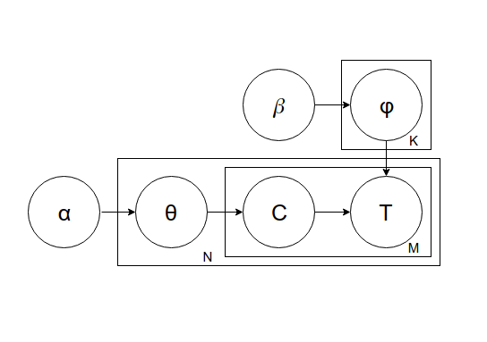

# **Effect of Latent Features On Text Classification**

Text classification is a task of assigning one or more predefined categories to a given text document. It provides a conceptual view of large archives of data. With the growing digitization of information in the form of news, articles, blogs, etc., it is becoming more and more difficult to search and find what we are looking for. Therefore, we need an efficient tool for summarizing a large set of documents to make the search and browsing process easier. For document classification we use terms/words (I'll be using these interchangeably) as features, there are some terms which are not actually present in the document but are relevant for assigning a category to a document, these are latent or hidden features. There are certain techniques to include these latent features in our feature space such as Latent Semantic Indexing (LSI), Latent Dirichlet Allocation (LDA) and Probabilistic Latent Semantic Indexing (pLSI). Applying these techniques before classification can help in improving the performance which is biased by the underlying feature representation. Latent features try to define the inherent relationship between documents and terms and thus improves the data representation. 

## **Different Latent Analysis Methods**

Suppose we have a set of documents  containing terms/words from vocabulary . If we ignore the sequential order of the occurrence of words in a document, this data can be represented by MXN **term-document matrix, X,** which describes the co-occurrences of terms and documents whose rows correspond to terms and columns correspond to document. The rows and columns are the vector space representation of terms and documents respectively. The matrix cell  can be the count of term i in document j. Typically [tf-idf](https://en.wikipedia.org/wiki/Tf%E2%80%93idf) (term frequency–inverse document frequency) is used as a weighting scheme for the cell values instead of just count. The key assumption is that this bag-of-words model will preserve the relevant information for document classification task based on keyterms. The below latent analysis methods are topic modeling methods, they try to find different mappings of this term-document matrix in latent space. They try to find a mixture of topics for each document and a collection of words for each topic.

### Latent Semantic Indexing

The term-document matrix representation doesn't cope with the problem of synonymy and polysemy. It doesn't capture the relationship between synonyms where two terms can have the same meaning (say car and vehicle) as each is a separate dimension in this vector space. Consequently, classification of a document containing both car and vehicle underestimates its true class. On the other hand, polysemy, where one word can have different meanings, can cause overestimation in the classification of a document as those two same words with different meanings will have the same vector representation. (Can we use the co-occurrence of terms?) The matrix is also a sparse matrix as a word might not be present in all the documents and a document might not contain all the words. This vector space representation is a high dimensional space. So, LSI finds a low-rank approximation to the term-document matrix using Singular Value Decomposition (SVD) to save computation cost, remove noisy terms, and to consider synonymy and polysemy. It basically tries to cluster the words into topics by keeping the semantically and syntactically similar words together. Using SVD X can be decomposed  as 
 where U represents the term-topic relationship, V represents the document-topic relationship and D is a diagonal matrix of singular values. The LSI approximation of X can be obtained by taking only the largest K singular values and setting others to 0. This approximation is rank K optimal in L_2 matrix norm. A vector representation of a document is reduced from M to K as columns of  can be thought of as getting expressed by K topics in latent space.

The rank lowering process can be seen as follows:
{(car), (bike), (restaurant)} → {(1.5 * car + 0.3 * bike), (restaurant)}

One major limitation of LSI is that the topics are not always interpretable. In the above example, one might say that (1.5 * car + 0.3 * bike) is representing vehicle but if the topic was (1.5 * car + 0.3 * restaurant) it has no interpretation in natural language but only justified at the mathematical level. 

### Probabilistic latent semantic analysis
pLSA takes a probabilistic approach to represent the data in latent space. LSI tries to find the principal components of the word vectors using SVD while pLSA uses the idea that a document is a mixture of topic distributions, the distribution of topics is different for different documents and each topic corresponds to a distribution over words. Here, topics are the latent variables and words and documents are the observed variables and hence the formulation is based on [latent class model](https://en.wikipedia.org/wiki/Latent_class_model). pLSA models the probability of multivariate variable (T, D) where D corresponds to documents and T corresponds to terms as a mixture of conditionally independent multinomial distribution i.e., it assumes that T is independent of D given topics C. It finds the distribution P(T, D) such that for any t, d, P(t, d) corresponds to the matrix cell in the term-document matrix.  Formally, the joint probability of co-occurrence of a word and a document is:

=P(d)\sum&space;_{c}P(c|d)P(t|c))

=&space;\sum&space;_{c}P(c)P(d|c)P(t|c))

As we can see from the above equations and figures, there are two different formulations. One is the asymmetric formulation where a document is chosen with probability P(d), then a topic is chosen with probability P(c|d) and then a word is generated with probability P(t|c). The second formulation is symmetric formulation where a topic is chosen with P(c) and then a document and a word are chosen with P(d|c) and P(t|c) respectively. pLSA is a generative process which aims to maximize the probability P(T, D) of the observed data. The parameters P(c|d), P(t|c), P(c) of these equations are estimated using EM algorithms. Although pLSA is a principled approach and has a solid foundation in statistics, there are certain limitations like we are not modeling P(D) so can't take care of new documents. The number of parameters grows with the number of documents 

### Latent Dirichlet Allocation
pLSA doesn't define proper priors at document levels and it's difficult to assign probabilities to new documents outside of training data. LDA, on the other hand, uses Dirichlet priors for per-document topic distributions and per-topic word distribution and hence generalizes well for new documents. LDA process can be seen in the below figure. 

α is the parameter of the Dirichlet prior on the per-document topic distributions,
β is the parameter of the Dirichlet prior on the per-topic word distribution,

A random sample θ representing the topic distribution of a document is drawn from Dirichlet distribution Dir(α), then a topic c is chosen from θ. Then, a random sample φ representing the word distribution of the topic c is drawn from Dir(𝛽) and a word t is chosen from φ. One limitation of LDA is that Dirichlet topic distribution cannot capture the correlations between topics. 

### Conclusion
LSI uses linear algebra method SVD to transform the higher dimensional term-document matrix into a lower dimensional latent space. It performs better than the naive vector representation, it's a simple unsupervised technique which can capture synonyms really well but not polysemy so well. It's language independent and the latent features are not always interpretable. pLSA is a generative model which provides the probabilistic interpretation of co-occurrence of documents and words. It takes care of polysemy and synonymy better by using mixture models to define the probability distributions over topics and words. The computation grows linearly with the documents and it doesn't work well with new documents. LDA uses Dirichlet priors for documents and words and generalizes well with the new documents but cannot capture correlations between the topics. All these methods are the alternative to feature representation and if applied before the classification process, they can help in improving accuracy. 

### References
[[1] https://en.wikipedia.org/wiki/Latent_semantic_analysis](https://en.wikipedia.org/wiki/Latent_semantic_analysis)

[[2] https://en.wikipedia.org/wiki/Probabilistic_latent_semantic_analysis](https://en.wikipedia.org/wiki/Probabilistic_latent_semantic_analysis)

[[3] https://en.wikipedia.org/wiki/Latent_Dirichlet_allocation](https://en.wikipedia.org/wiki/Latent_Dirichlet_allocation)
